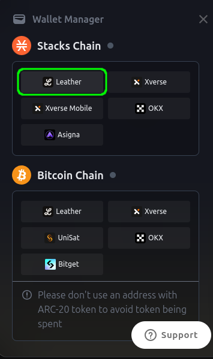

# How to Connect your Wallet

Follow these steps to connect your wallet to XLink App.

[**🌁 Connect to XLink and Start Bridging Now!**](https://app.xlink.network)

### Step 1: Open the Wallet Manager

First, click on the **Wallet Manager** located in the top right corner of the XLink app. This is where you’ll manage all your wallet connections.

### Step 2: Choose the Blockchain and Wallet

In the Wallet Manager, select the blockchain you are using (e.g., **Stacks Chain**, **Bitcoin Chain** or **EVM Chain**), then choose the wallet that you want to connect. Supported wallets include Leather, Xverse, and others. 


See the [Prerequisites](../prerequisites) section for the list of **Supported Wallets** and their installation guides.


For this example we will choose **Stacks Chain** and **Leather** wallet.

### Step 3: Enter Your Password

After selecting your wallet, you will be prompted to enter your wallet’s password.

### Step 4: Select Your Account

Once the password is entered, choose the specific account you want to connect. This account will be used for executing transactions on the bridge.

### Step 5: Confirm Your Connection

Once the wallet is successfully connected, you will notice the blockchain icon in the top right corner of the screen, confirming that your wallet has been successfully linked.

Here's a proofread version based on your comment:

 Keep in mind that, for bridging, you will need to connect wallets for both the source and destination blockchains (e.g., Stacks, Bitcoin, and EVM). Once connected, you will see the respective blockchain icons in the top right corner of the app. 
