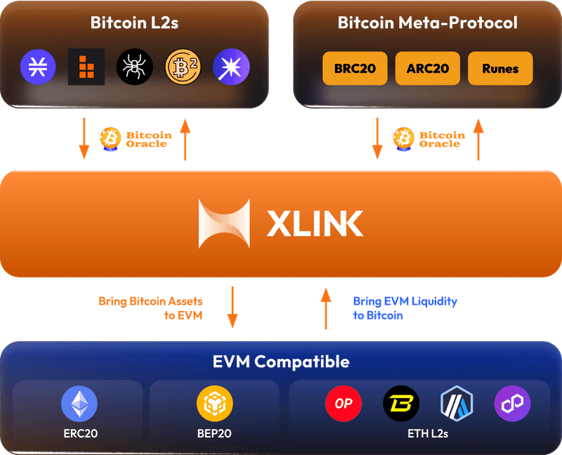

# How XLink Bridge Works?

The XLink Bridge is a hybrid bi-directional bridge that acts as a 'connector' between Bitcoin and other blockchains. When you want to move assets (like Bitcoin) from one network to another, XLink handles the process, making sure everything happens securely.

XLink works by using secure multisignature wallets (multisigs) and special checkpoints called Endpoints to manage the transfer of assets. For example, when you want to move your Bitcoin to another blockchain, XLink "locks" your Bitcoin in a multisig on the Bitcoin network. Then, an equivalent amount is unlocked on the other blockchain through an Endpoint, which is a smart contract responsible for handling the transfer. These Endpoints are owned by multisigs and operated by a decentralized network of validators and verifiers, ensuring that the process is secure and reliable. This system allows you to use your Bitcoin in different blockchain environments, like Ethereum or other layer 2 networks, while keeping your original assets safe.
